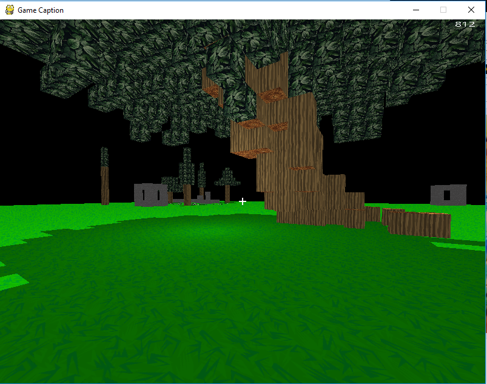

**Description**
This is a demonstration game to prove that python is powerful enough to be used for 3d graphics.
Heavily influenced by Minecraft this voxel game recreates some of the core mechanics and extends on some of the graphical features.

**How to use**
* Create a virtual environment with python 3.6 and install the requirements in requirements.txt
 * Run main.py in src folder

**Controls**
* Mouse to look around
* WASD to move around
* Space to go up, Shift to go down (if flying is enabled)
* Space to jump (if flying is disabled)
* Left click break block, Right click place
* I to toggle infinite blocks (middle click on a block you want to place infinitly)
* F to toggle flying
* K to place a point light where the player currently is
* E to toggle release of mouse
* LEFT, RIGHT arrow keys to change time of day / shadow direction

**Features List**
* Chunk loading / unloading / generation
* World saving / loading
* Chunk defaults
* Placing and breaking blocks
* Point light
* Changeable World Shadows / Time of day
* High framerate (Counter in top left corner)
* Secondary process for world generation / file IO
* Finite loop around worlds

More info at https://parker.hessbros.net/page2.html

